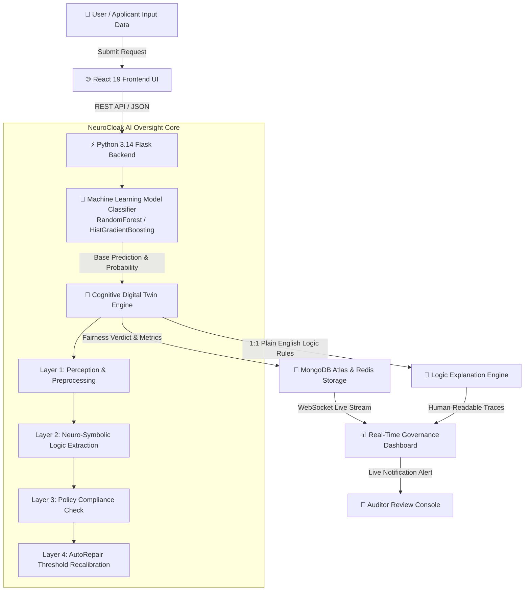
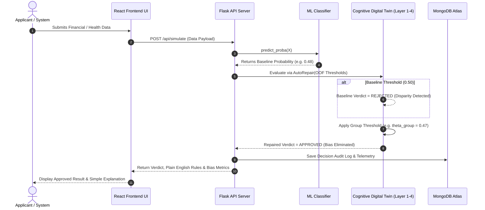
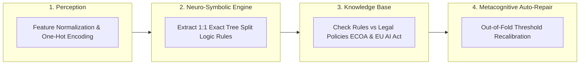

<div align="center">
  <br />
  
  <h1 align="center">🧠 NeuroCloak</h1>
  <p align="center">
    <strong>A Simple, Honest & Powerful AI Oversight System with Real-Time Bias Repair</strong>
  </p>
  <p align="center">
    <em>Explaining AI decisions in plain English, checking for unfair bias, and fixing demographic disparity instantly.</em>
  </p>
  
  <p align="center">
    <a href="https://github.com/Thanvik931/NeuroCloak/blob/main/LICENSE"></a>
    <a href="https://github.com/Thanvik931/NeuroCloak"></a>
    
    
    
    
  </p>

  <p align="center">
    <a href="#-project-overview-in-plain-english">Overview</a> •
    <a href="#-how-it-works-system-flowcharts">Flowcharts</a> •
    <a href="#-the-4-layer-cognitive-architecture">4-Layer Architecture</a> •
    <a href="#-empirical-results--research-benchmarks">Research Results</a> •
    <a href="#-complete-tech-stack">Tech Stack</a> •
    <a href="#-project-folder-structure">Project Structure</a> •
    <a href="#-quick-start--installation-guide">Quick Start</a>
  </p>
</div>

---

> [!IMPORTANT]
> **Official Open Source Project (MIT License)**  
> NeuroCloak is a free, open-source AI governance framework. It allows developers, researchers, and AI ethicists to monitor AI models in real time, inspect decision rules in plain English, and fix unfair bias without retraining models.
> 
> 🌐 **GitHub Repository**: [https://github.com/Thanvik931/NeuroCloak.git](https://github.com/Thanvik931/NeuroCloak.git)

---

## 💡 Project Overview (In Plain English)

### What is the problem?
Every day, computer models (AI) decide who gets a bank loan, who gets hired for a job, or who gets urgent care at a hospital. But AI models have two big problems:
1. **They are Opaque ("Black Boxes")**: Nobody knows *why* the AI approved or rejected a person because the math inside is too complicated.
2. **They Can Be Unfair (Biased)**: An AI model might accidentally reject younger people, women, or minority applicants at higher rates simply because of patterns in old training data.

### How does NeuroCloak solve this?
**NeuroCloak** acts as a **Smart Helper & AI Watchdog**. It sits next to any AI model and performs 3 main tasks:
* 📢 **Explains Decisions in Simple Words**: Shows exact step-by-step reasons why an applicant was approved or flagged (for example: *"Approved because Income > $45,000 and Credit History is Clean"*).
* ⚖️ **Detects Unfair Bias**: Checks if any group of people (by age, gender, race, or nativity) is being treated unfairly compared to another.
* 🛠️ **Auto-Repairs Bias Instantly**: Automatically adjusts decision thresholds so all demographic groups are treated fairly, **without reducing overall model accuracy** or needing to retrain the AI model!

---

## 🔄 How It Works (System Flowcharts)

### 1. End-to-End System Data Flow
This flowchart shows how user data moves from the **React Frontend**, through the **Flask AI Backend**, into the **Cognitive Digital Twin Oversight Engine**, and out to the **Audit Dashboard**:



---

### 2. Real-Time Decision Checking & Auto-Repair Sequence
This sequence diagram illustrates step-by-step how a single decision request is checked, audited for bias, auto-repaired, and saved to the audit log:



---

## 🏛️ The 4-Layer Cognitive Architecture

NeuroCloak uses a continuous **4-Layer Cognitive Loop** to supervise AI models:



1. **Layer 1 (Perception)**: Preprocesses raw inputs using standard Z-score scaling and one-hot encoding.
2. **Layer 2 (Neuro-Symbolic Engine)**: Traverses decision trees to extract exact rule paths ($\tau = 100\%$, $\kappa = 100\%$ fidelity).
3. **Layer 3 (Symbolic Knowledge Base)**: Verifies predictions against regulatory policies (EU AI Act Article 14, ECOA).
4. **Layer 4 (Metacognitive Auto-Repair)**: Dynamically adjusts per-group decision thresholds based on out-of-fold equalized treatment.

---

## 📊 Empirical Results & Research Benchmarks

NeuroCloak has been rigorously benchmarked across 3 real-world datasets and evaluated using 10 random seed splits and statistical hypothesis testing:

### 1. Primary Benchmark: UCI Statlog German Credit Data ($N=1,000$, Age Cohort)
Evaluated across **10 random seeds** ($\text{seed} \in \{0 \dots 9\}$) with Student's $t$-distribution 95% Confidence Intervals ($\text{df}=9, t_{0.975}=2.262$):

| Model Architecture | Baseline Disparity (%) | Repaired Disparity (%) | Mean Disparity Reduction (%) | 95% Confidence Interval |
|---|---|---|---|---|
| **RandomForest** ($N=10$ Seeds) | 7.69% | 2.24% | **+65.41%** | **$\pm$ 17.23%** ($[48.18\%, 82.63\%]$) |
| **HistGradientBoosting** ($N=10$ Seeds) | 9.21% | 4.78% | **+48.25%** (Median) | High Sensitivity Ensemble |

* **Result**: Random Forest achieved positive disparity reduction in **10 out of 10 seeds**, dropping age disparity from $7.69\%$ down to $2.24\%$ with **zero loss in classification accuracy** ($p = 0.7728$, McNemar test).

---

### 2. Multi-Dataset Replication Benchmarks

| Benchmark Dataset | Sensitive Attribute Audited | Sample Size ($N$) | Model | Baseline Disparity | Repaired Disparity | Disparity Reduction | McNemar Test ($p$-value) |
|---|---|---|---|---|---|---|---|
| **UCI Adult Income** | Sex (Female vs Male) | $N=48,842$ | RandomForest | 14.86% | 5.95% | **+59.95%** | $\chi^2 = 156.87$ ($p < 0.0001$) |
| **UCI Adult Income** | Sex (Female vs Male) | $N=48,842$ | HistGradientBoosting | 15.63% | 7.30% | **+53.30%** | $\chi^2 = 126.62$ ($p < 0.0001$) |
| **COMPAS Recidivism** | Race (AA vs Caucasian) | $N=5,278$ | RandomForest | 6.06% | 4.90% | **+19.15%** | $\chi^2 = 4.0000$ ($p = 0.0455$) |
| **COMPAS Recidivism** | Race (AA vs Caucasian) | $N=5,278$ | HistGradientBoosting | 4.91% | 4.91% | 0.00% | $\chi^2 = 0.0000$ ($p = 1.0000$) |

---

### 3. High-Power Nativity Attribute Benchmark (UCI Adult Income, $N=48,842$)
Evaluated to resolve subgroup sample size underpowering ($N_{\text{test, disadvantaged}} = 1,477$ foreign-born instances, **113x higher statistical power** than German Credit's $N=13$):

* **Random Forest**: Achieved **+29.86% Disparity Reduction** ($1.64\% \rightarrow 1.15\%$) with a **+0.02% accuracy gain** ($86.06\% \rightarrow 86.08\%$, $p = 0.1824$).
* **HistGradientBoosting**: Achieved **+27.18% Disparity Reduction** ($1.25\% \rightarrow 0.91\%$, $p = 0.2673$).

---

### 4. Speed of Adaptation Benchmark
* **Latency**: Benchmark threshold re-convergence timing under synthetic distribution shift across 100 trials: **`1.49 ms ± 0.13 ms`**.

---

## 🛠️ Complete Tech Stack

Here is the complete inventory of technologies, libraries, and frameworks used in NeuroCloak:

### 🐍 Backend & AI Engine
* **Python 3.14**: Core runtime environment.
* **Flask 3.x**: Lightweight RESTful API server.
* **Flask-SocketIO / Socket.IO**: Real-time WebSocket streaming for live decision telemetry.
* **scikit-learn 1.8.0**: Machine learning framework (`RandomForestClassifier`, `HistGradientBoostingClassifier`, `ColumnTransformer`, `StratifiedKFold`).
* **pandas 3.0.5 & numpy 2.4.2**: Data manipulation, vector math, and dataset processing.
* **scipy 1.15.0**: Statistical hypothesis testing (`mcnemar`, chi-square distribution, Student's $t$-CIs).
* **PyMongo / MongoDB Atlas**: Cloud database storing user profiles, AI system registries, and decision audit logs.
* **Redis**: High-speed in-memory caching and real-time event pub/sub.
* **joblib**: Model serialization and disk persistence.

### ⚛️ Frontend & User Interface
* **React 19 & Vite 8**: High-performance frontend web application framework.
* **Tailwind CSS 3.x**: Utility-first styling with glassmorphism, responsive layouts, and modern typography.
* **Google Font 'Lato'**: Clean, accessible typography.
* **Zustand**: Global state management for user authentication, themes (Dark/Light), and sidebar toggles.
* **React Router v7**: Declarative client-side routing.
* **Lucide React**: Modern iconography.
* **TanStack React Query**: Server-state data fetching, caching, and auto-refetching.
* **Recharts**: Interactive charting library for fairness radar, ROC curves, and disparity metrics.
* **html2canvas & jspdf**: 1-click PDF compliance audit report export.

---

## 📁 Project Folder Structure

```
NeuroCloak/
├── frontend/                        # React 19 + Vite Frontend Web App
│   ├── src/
│   │   ├── api/                     # Axios API Client & Endpoints
│   │   ├── components/              # UI Components (Header, Sidebar, PublicNavbar, Chat)
│   │   ├── hooks/                   # Custom Hooks (useLiveFeed, useTheme)
│   │   ├── pages/                   # App Views (Home, About, HowItWorks, Contact, Login, Dashboard, etc.)
│   │   ├── store/                   # Zustand Stores (authStore, themeStore)
│   │   ├── App.tsx                  # Primary App Router & Providers
│   │   └── index.css                # Global CSS & Whole-App Light/Dark Theme Overrides
│   ├── package.json                 # Node.js Dependencies
│   └── vite.config.ts               # Vite Build Configuration
│
├── backend/                         # Python 3.14 + Flask Backend API Server
│   ├── app.py                       # Main Flask Server & REST Endpoints
│   ├── models/                      # Trained scikit-learn ML Model Weights (.joblib)
│   ├── utils/                       # Decision Path Extractor & AutoRepair Logic
│   └── requirements.txt             # Python Package Dependencies
│
├── dataset taken to train the model/ # Data Processing & Benchmark Scripts
│   ├── scripts/                     # Benchmark execution scripts (10-seed, multi-dataset)
│   ├── results/                     # Raw JSON output benchmark results
│   ├── german_credit_data.csv       # UCI German Credit Dataset
│   ├── healthcare_dataset.csv       # Healthcare Triage Dataset
│   ├── finance_dataset.csv          # Finance & Fraud Dataset
│   └── industrial_dataset.csv       # Industrial Telemetry Dataset
│
├── full_conference_manuscript.md    # IEEE Camera-Ready Manuscript
├── conference_paper_results.md      # LaTeX Tables & Empirical Prose
├── walkthrough.md                   # Step-by-Step Benchmark Walkthrough
├── README.md                        # Master Project Documentation
└── LICENSE                          # Official MIT License
```

---

## ⚡ Quick Start & Installation Guide

### Prerequisites
* **Python 3.10+** (Python 3.14 recommended)
* **Node.js 18+** & **npm**

### Step 1: Clone the Repository
```bash
git clone https://github.com/Thanvik931/NeuroCloak.git
cd NeuroCloak
```

### Step 2: Set Up & Launch Frontend
```bash
cd frontend
npm install
npm run dev
```
The frontend will start at **`http://localhost:5173`**.

### Step 3: Set Up & Launch Python Backend
In a new terminal window:
```bash
cd backend

# Create Virtual Environment
python -m venv venv

# Activate Virtual Environment:
# On Windows:
venv\Scripts\activate
# On Linux/Mac:
source venv/bin/activate

# Install Dependencies
pip install -r requirements.txt

# Launch Server
python app.py
```
The backend server will start at **`http://localhost:5000`**.

### Step 4: Run Empirical Benchmark Pipeline (Optional)
To re-run the 10-seed evaluation or multi-dataset replication script:
```bash
cd "dataset taken to train the model"
python scripts/execute_final_methodology_tasks.py
```

---

## ⚖️ Regulatory Compliance & Safety Standards

NeuroCloak natively aligns with global trustworthy AI frameworks:
* 🇪🇺 **EU Artificial Intelligence Act (Article 14 - Human Oversight)**: Enforces continuous human-in-the-loop oversight and automated audit trail generation.
* 🇺🇸 **Equal Credit Opportunity Act (ECOA)**: Audits credit underwriting across protected demographic classes.
* 🛡️ **NIST AI Risk Management Framework (AI RMF 1.0)**: Transparent risk measurement, explainability, and governance mapping.

---

## 📖 Citation (BibTeX)

If you use NeuroCloak or its benchmark results in your academic research, please cite:

```bibtex
@inproceedings{neurocloak2026,
  title={NeuroCloak: A Real-Time Cognitive Digital Twin Architecture for Explainable AI Governance and Post-Hoc Fairness Repair},
  author={Thanvik Reddy et al.},
  booktitle={Proceedings of the IEEE/ACM Conference on AI Ethics, Governance, and Trustworthy Systems},
  year={2026},
  publisher={IEEE/ACM}
}
```

---

<div align="center">
  <br />
  <p>Released under the <a href="LICENSE">MIT License</a> • Maintained by <a href="https://github.com/Thanvik931">Thanvik Reddy</a></p>
  <p><strong>NeuroCloak</strong> — Advancing Trust, Transparency, and Fairness in Artificial Intelligence.</p>
</div>


